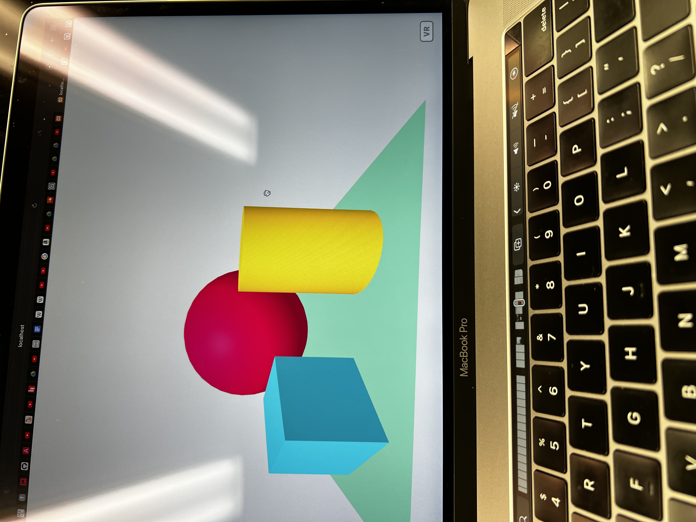
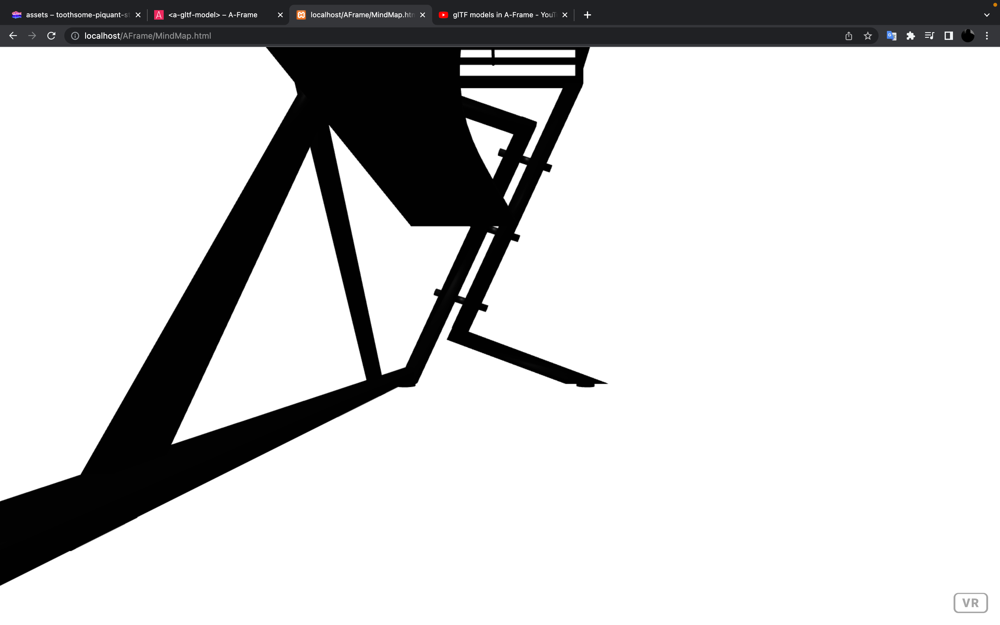
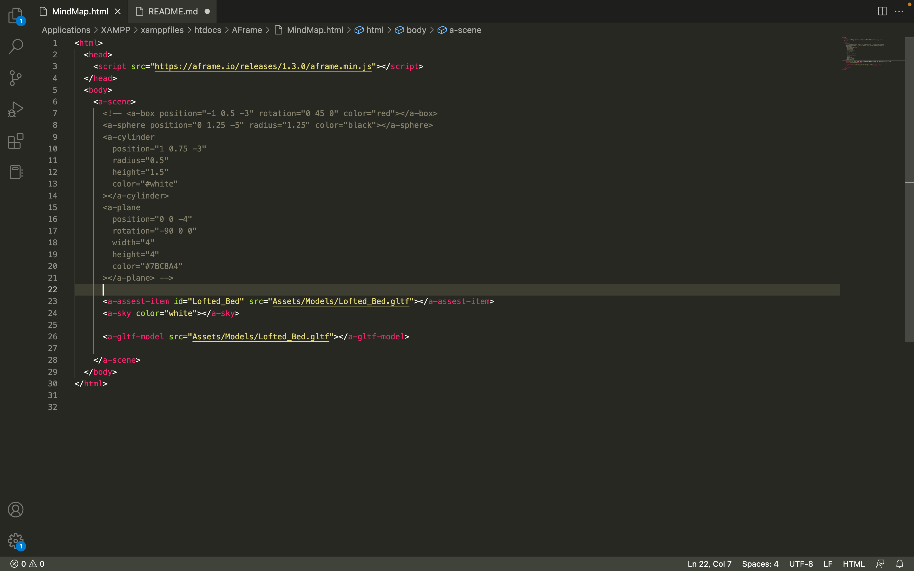
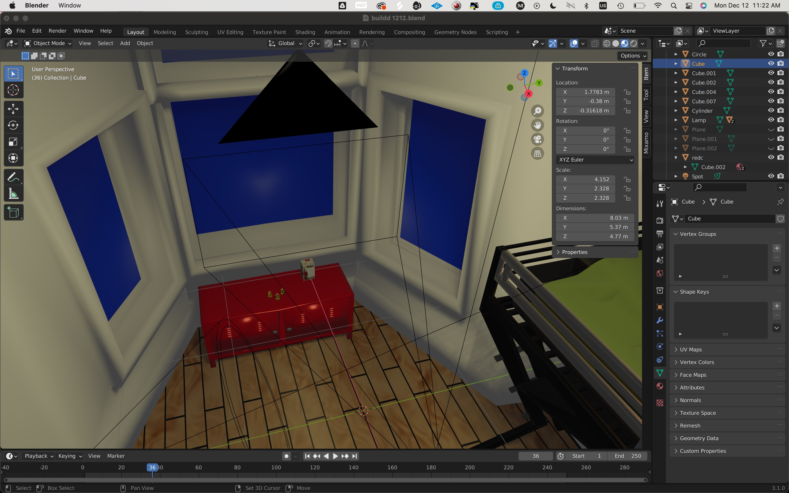
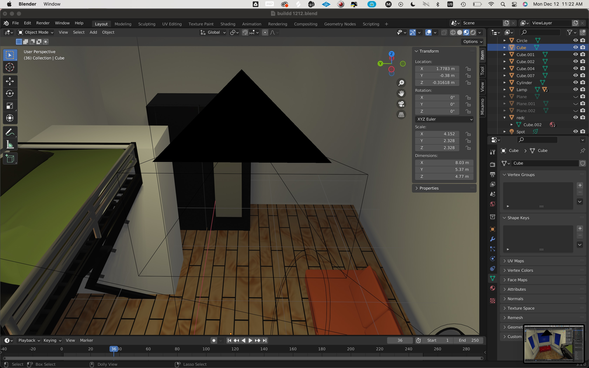

# [MIND MAP](https://mindmapz.glitch.me/#)
- 

## Instructions:
- Open Website on Google Chrome
- Wait for items to appear
- Use WASD to navigate spatially
- To interact with items, hover your mouse over said item.
- DO NOT WALK OUT THE ROOM :)

## Process:
- I started off with listed items I would need to model and then thinking of some functional ideas i think could work from working in max. The models where generally easy to make. I used generally simple texures because it seems like A-frame is Lofi aesthically. Before starting the code I made a playlist of videos that could help me through the process. This allowed me to know that i needed Xmapp. Currently I am using VScode and Glitch to prototype. I started by modifering ther generic webvr patch. From there, I added in an gltf model. There was some problems with this. Originally i used obj but i could not get tghem to work and then i saw on Aframe that gltf work better so i used that. However this I didnt delete the code, edited, and the lead to some syntaxt problems.

- While finishing up other projects, I worked on the 3D models. I at first exported them as obj. but once I started to read the documents for A-frame, I notice gltf is less hassle. From here, I reexported one model and using VScode and Xmapp. I displayed the model on my localhost. Instinctly, I started to press wasd and notice this allowed you to move throughout the scene. The next thing i moved on to was lighting. I copied some code from the documents and got a blue and orange light to appear. From here I linked a primitive, box, to the position of one of the lights. From here, i noticed I started to get lost in all the possiblitlies so i decided to look back at the playlist i made and ended up following a tutorial series. With this i was able to develop a clearer understanding of the things i was messing around with in AFrame, entities,cameras,and primitives. With following the tutorials, i decided to switch over to glitch for containing my code. I found this to be nicer since it has a preview window on the side and it can provide a non-localized link.

- From here, I made a project that when the cursor hovers over a shape, it rotates and changes the color. From this I added sound to this project. This was based around three objects playing three different roles: Play, Stop and Speaker. At this moment I still wanted to learn more: CSS, video interaction, joysticks, mobile, JS. However at this point it was Tuesday night. So at this point I finished all the models and added them into one scene in blender. I then figured out i could export them and they will appear in the same location when I upload them. However, I exported and uploaded all my models. At this point I realized I didn't click "selected object only". So I exported 17 full scenes. So that took additional time having to rexport them. Once i uploaded them to GLITCH, i begin calling them and implementing the models. Once I got a few in there, I used the A-Frame inspector and decided I needed to scale all the models up so that there was more room to more around. Once everything was loaded, I figured i could just use the "mouseenter" and "mouseleave" on one model and that could be for playback. Unfortunately, I and, from what I saw on the internet, others haven't been able to figure this out in A-Frame. In the process of this, I tried to implement several code varaitions in javascript and HTML. I do think that with me only doing the css file for the group website, I didn't realize how simple adding and formatting text can be. At this point I also decided to save verison of the glitch code in vscode, github, so I could easily recall older verison if I mess up too bad, commenting some lines do not work in glitch.

- From here, I had all the models in the scene. Walking on i decided i was gonna take a panaromic picture and apply it to a videosphere so it is like you are looking out the window in real life (the orginial idea with this was to either take a 24hour/timelapse video and have it playing or using some sort of code to track the amount of "sunlight" in boston and reflect that in the scene). I also decided I wanted to add extra models because the VR space was a little bland. This was also the point i decided to add in the couple posters for more interaction. After this, i decided i should probably finish my project so I implemented my audio using a green and black for playback. The black ball turns to red when activated. 2 of them were easy to setup, just copied the code and then edited the tags. However, then I decied I wanted to add a video. After and hour or so of work, playback on video is not the same as audio playback and i could not wrap my head around developing a component for it. So then I added in the last audio in the corner. I did have some syntaxt problem with this one, probably due to it being late, the orginial and the audio file being 200 mb. I started by triming and export mp3s of said tracks out of ableton. Once these were implemented, I noticed all the audio was coming from the middle of the room. I doubled check how I wrote the sound elements and then checked some youtube videos and saw that rather than assigning the sound to an model i can assign it to an invisible entity which allowed me to adjust the placement closer to ear level.
- Since about everything was generally there but I was generally underwhelmed, I decided I wanted to add adjusting lights with the music, yet did not have the time or patience to implement this. During this whole process, I ignored the fact that I said in my proposal I would have a mobile verison. So thursday morning before class, i tried to implement this. I had to add some cases for Safari and mobile audio and joysticks. Neither of these worked, with the information and time I had, joysticks images appeared but wouldn't move. Fast forward to class, I enjoy branding so i decided to using a model of me holding my head as the cover page of the presentation and the favicon of the website.
- ###### If you read all of this, pat yourself on the back. Great Job! Also is you "hating" on MAX similar to most of Berklee hating ProTools. Gotta love a good analogy. There also should be like grammarly for vscode. That would be clean.
 
 ###### "Macbook Pro 13 inch 2020" (https://skfb.ly/onozJ) by timblewee is licensed under Creative Commons Attribution (http://creativecommons.org/licenses/by/4.0/).

